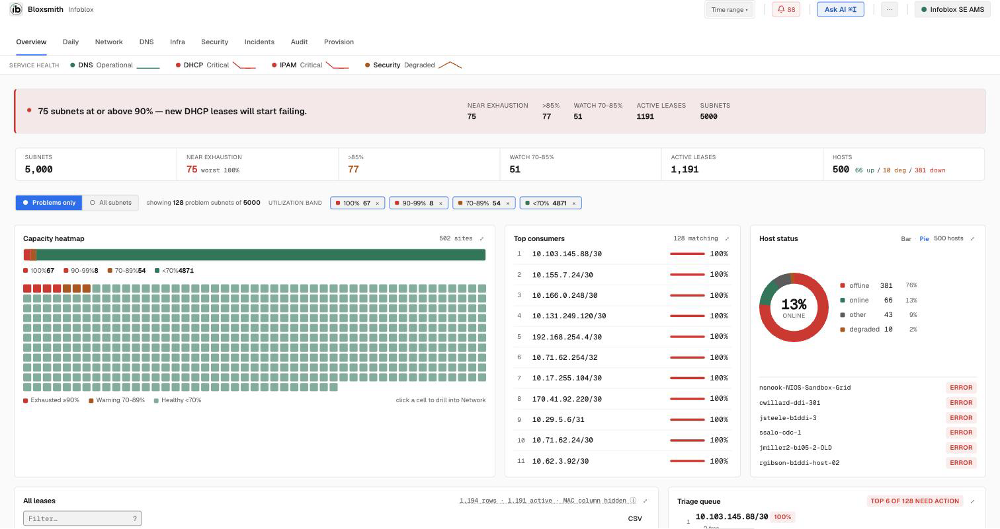

# Bloxsmith

[](LICENSE)
[](https://go.dev/)
[](docker-compose.yml)

**Bloxsmith** is a composable, self-hostable workbench for your **Infoblox Portal / CSP**
data — subnets, DHCP leases, DNS zones, hosts, security policies, threat feeds, and audit
logs, plus an optional natural-language query box. Build your own views instead of living in
a fixed monitoring dashboard. It ships as a **single Go binary** that talks to the Infoblox
cloud over **MCP** and serves its React workspace at `http://localhost:8080` — the UI is
embedded in the binary, so there is nothing else to install.



```
browser ──HTTP──▶ bloxsmith (Go binary) ──MCP──▶ csp.infoblox.com/mcp
                       └── optional: LLM (Groq / OpenAI-compatible) for NL queries
```

(The binary exists because browsers can't call the Infoblox MCP endpoint directly — CORS, and MCP is JSON-RPC/SSE. It's the server-side hop that holds your API key.)

---

## Quick start

### Path A — Standalone binary (laptop, **no Docker needed**)

One self-contained binary — no Docker, no Python, no clone. macOS and Linux:

```bash
curl --proto '=https' --tlsv1.2 -fsSLo install.sh https://github.com/holland-built/bloxsmith/releases/latest/download/install.sh && less install.sh && sh install.sh
```

Read it before you run it — that's what the `less` is for. The installer verifies the release's SHA-256 checksum, refuses to install on a mismatch, and drops `bloxsmith` in `~/.local/bin` (no sudo; override with `--prefix DIR`, pin with `--version vX.Y.Z`).

```bash
bloxsmith                  # start it → http://localhost:8080
bloxsmith service install  # run it in the background at login
bloxsmith update           # upgrade in place
```

**Windows** — download, inspect, then run `install.ps1` (no admin, no winget):

```powershell
iwr -UseBasicParsing -OutFile install.ps1 https://github.com/holland-built/bloxsmith/releases/latest/download/install.ps1
# read install.ps1, then:
powershell -ExecutionPolicy Bypass -File .\install.ps1
```

It verifies the release's SHA-256, drops `bloxsmith.exe` in `%LOCALAPPDATA%\Programs\Bloxsmith`, and adds it to your user PATH. Reopen the shell, then run `bloxsmith`. Or skip the script and download the `bloxsmith_<ver>_windows_amd64.zip` straight from the [latest release](https://github.com/holland-built/bloxsmith/releases/latest). The app self-updates in place — no `winget upgrade`. (install.ps1 is new; tested on PowerShell 5.1+/7 — run it once on a real Windows box to confirm before wide use.) The checksum proves the download is intact, not that the publisher is who they claim; the binary is unsigned.

### Path B — Docker image (server / SE demo)

Prereq: **Docker** — [Docker Desktop](https://www.docker.com/products/docker-desktop/) (macOS/Windows) or Docker Engine (Linux: `curl -fsSL https://get.docker.com | sh`).

Run the prebuilt image (no clone, no build):

```bash
docker run -d --name bloxsmith -p 127.0.0.1:8080:8080 \
  -v noc-vault:/vault --restart unless-stopped \
  ghcr.io/holland-built/bloxsmith:latest        # your machine → http://localhost:8080
# LAN demo: swap 127.0.0.1: for 0.0.0.0: to bind all interfaces → http://<host-ip>:8080
```

Pin a release with a tag (`:v2.0.0`) instead of `:latest`. Tenant keys live AES-encrypted in the `noc-vault` volume.

> ⚠️ **LAN mode has no login.** Anyone on the network can reach the dashboard and query your Infoblox tenant. Keep the vault **locked** when not presenting, or use Path C's secure proxy.

### Path C — Customer install (always-on server, compose)

You're self-hosting this permanently on a server/VM (Proxmox, NUC, cloud).

```bash
git clone https://github.com/holland-built/bloxsmith && cd bloxsmith
cp .env.example .env                       # optional: pre-set keys; blank = in-app vault
docker compose up -d                       # loopback only → http://localhost:8080
BIND=0.0.0.0 docker compose up -d          # expose on the LAN (no login — see warning)
docker compose --profile secure up -d      # + Caddy TLS + basic-auth on :8443 (recommended for LAN)
```

Tenant keys live AES-encrypted in the `noc-vault` Docker volume — they survive updates, restarts, and container recreation.

First open (either path): pick a passphrase, add your [Infoblox API key](#get-your-infoblox-api-key).

## Updating

Bloxsmith checks GitHub once a day in the background for a newer release (server-side; disable with `DISABLE_UPDATE_CHECK=1`). Nothing updates automatically — applying is always your call.

**Standalone binary:** click the version badge → **Update now** (or run `bloxsmith update`). It downloads the new release tarball, verifies its checksum, and atomically swaps the binary in place.

**Docker:** click **Update now** to pull the new image over the mounted Docker socket, health-check it, and swap in — automatic rollback if the new version fails to start (the socket is mounted by compose by default). Or update manually:

```bash
docker compose pull && docker compose up -d    # customer/compose
```

Your vault (tenant keys, passphrase) lives in the `noc-vault` volume and survives every update.

### Automatic updates — your choice at install

Pick one; you are never forced into either:

| Mode | How | Who it's for |
|------|-----|--------------|
| **Manual only (default)** | `docker compose up -d` | **Enterprise / production.** Nothing ever changes on its own; an admin clicks **Update now** (or runs the pull) when they choose. Recommended when the app holds live-tenant write credentials. |
| **Auto-update** | `docker compose --profile autoupdate up -d` | **SE demo laptops.** A Watchtower sidecar pulls new releases automatically so a demo box is always current. |

If a new image fails to boot, the in-app updater auto-reverts to the previous image (tagged `bloxsmith:rollback`). Enterprise installs should pin an exact image by digest — see `docs/SHIP.md`.

## Get your Infoblox API key

1. Sign in to <https://csp.infoblox.com>.
2. Top-right user menu → **User API Keys** → **Create**.
3. Copy the token, paste it into the dashboard setup.

<details>
<summary><b>More ways to run</b> (single-key env, Compose, secure proxy, build from source)</summary>

```bash
# Single key, skip the vault:
docker run -d --name bloxsmith -p 127.0.0.1:8080:8080 \
  -e INFOBLOX_API_KEY="Token <key>" ghcr.io/holland-built/bloxsmith:latest

# Compose (always-on servers / Proxmox):
BIND=0.0.0.0 docker compose up -d              # LAN
docker compose --profile secure up -d          # + Caddy TLS + basic-auth

# Build from source (dev) — Go 1.26+:
git clone https://github.com/holland-built/bloxsmith && cd bloxsmith
cd ui && npm ci && npm run build && cd ..        # Vite build → refreshes the embedded UI (go/web/)
cd go && go build -o bloxsmith . && ./bloxsmith  # → http://localhost:8080

scripts/dev-serve.sh [port]                     # LIVE dev (default :8090): edit ui/src → Vite
                                                #   rebuild → go/web, binary serves from disk via WEB_DIR
```

Full steps, the deploy matrix, auto-unlock, and pinning → **[docs/DEPLOYMENT.md](docs/DEPLOYMENT.md)**.
</details>

<details>
<summary><b>AI query box</b> (optional)</summary>

The natural-language query box needs an LLM with tool-calling; everything else works without it. Default is **Groq** (free tier — fast, free models, good for demos): get a key at <https://console.groq.com> and set it in the dashboard (sidebar → **⚙ AI provider**) or via `GROQ_API_KEY`. Any OpenAI-compatible provider works — see [docs/DEPLOYMENT.md](docs/DEPLOYMENT.md#using-a-different-llm-provider).
</details>

---

- **Full deployment & env reference →** [docs/DEPLOYMENT.md](docs/DEPLOYMENT.md)
- **Security policy →** [SECURITY.md](.github/SECURITY.md) · **Contributing →** [CONTRIBUTING.md](.github/CONTRIBUTING.md)
- Released under the [MIT License](LICENSE).
