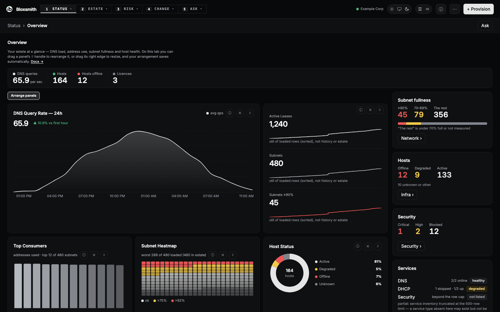

<div align="center">
  
  <h1>Bloxsmith</h1>
  <p>Self-hosted workbench for your Infoblox Portal / CSP data.</p>

  [](https://github.com/holland-built/bloxsmith/actions/workflows/ci.yml)
  [](https://github.com/holland-built/bloxsmith/releases/latest)
  [](https://github.com/holland-built/bloxsmith/commits/master)
  [](LICENSE)
  [](https://go.dev/)
  [](docker-compose.yml)
</div>



|  |  |
|---|---|
| **Subnets & DHCP** | leases, utilization, exhaustion |
| **DNS & zones** | records, zones, query rates |
| **Security & threat feeds** | policies, indicators, audit logs |
| **Single Go binary** | embedded UI, no runtime deps |
| **Encrypted vault** | tenant keys AES-encrypted at rest — protects a stolen disk, [not a live machine](docs/DEPLOYMENT.md#what-aes-encrypted-vault-is-worth-exactly) |
| **Optional AI query box** | natural-language over your data |

**[What each tab does →](docs/TABS.md)** — all 15 tabs, which ones write to Infoblox, and how the dry-run/apply flow works.

## Install

Pick your platform, copy the whole block, paste it into a terminal. No block needs
you to run its lines one at a time. The script installers ask one yes/no question
at the end (whether to start Bloxsmith at login) — answer it and you're done.

### Docker — any OS

```bash
docker run -d --name bloxsmith \
  -p 127.0.0.1:8080:8080 -v noc-vault:/vault \
  --restart unless-stopped \
  ghcr.io/holland-built/bloxsmith:latest
```

### macOS

```bash
brew install holland-built/tap/bloxsmith
bloxsmith
```

No Homebrew? Use the **macOS / Linux script** below instead.

### Windows

Open **Command Prompt** (press <kbd>Win</kbd>, type `cmd`, hit Enter), then paste:

```bat
powershell -Command "iwr -UseBasicParsing -OutFile install.ps1 https://github.com/holland-built/bloxsmith/releases/latest/download/install.ps1"
powershell -ExecutionPolicy Bypass -File .\install.ps1
```

The same two lines also work in PowerShell. `powershell -Command` is what makes
`iwr` run from `cmd.exe`.

### macOS / Linux script

```bash
curl --proto '=https' --tlsv1.2 -fsSLo install.sh https://github.com/holland-built/bloxsmith/releases/latest/download/install.sh
sh install.sh
```

**Then open <http://localhost:8080>.** Pick a passphrase, paste your
[Infoblox API key](#get-your-infoblox-api-key). Keys are encrypted at rest and
survive restarts and updates.

Docker keeps running on its own. The macOS/Linux `bloxsmith` command holds the
terminal open — close it with <kbd>Ctrl</kbd>+<kbd>C</kbd>, or run
`bloxsmith service install` once to start it automatically at login instead.

<details>
<summary><b>Read the installer before running it · Docker Compose</b></summary>

**Inspect first.** The installers check a SHA-256 checksum and an Ed25519 signature
and refuse to install if either fails — but you should still read what you run. Paste
the *first* line of the block above on its own, then:

```bash
less install.sh        # macOS / Linux — press q to quit
```
```bat
notepad install.ps1
```

…and paste the second line once you're happy.

**Docker Compose** — gives you the in-app update banner and an easy tag to pin:

```bash
curl -fsSL https://raw.githubusercontent.com/holland-built/bloxsmith/master/docker-compose.yml -o docker-compose.yml
docker compose up -d
```

Full options and deployment guidance are in [docs/DEPLOYMENT.md](docs/DEPLOYMENT.md).

</details>

## Get your Infoblox API key

1. Sign in to <https://csp.infoblox.com>.
2. Top-right user menu → **User API Keys** → **Create**.
3. Copy the token, paste it into the dashboard setup.

<details>
<summary><b>How the installers verify downloads &amp; where they land</b></summary>

Read it before you run it — that's what inspecting the script first is for. Both installers verify the release's SHA-256 checksum and refuse to install on a mismatch, and `install.sh` also verifies an **Ed25519 signature over `checksums.txt`** against a public key pinned in the script itself — so the thing deciding whether a release is genuine does not travel with the release. **It refuses to install if that signature is missing or does not verify**, because an attacker who can replace release assets would simply delete it. Verification uses `ssh-keygen`, which ships by default on macOS, Linux and Windows, falling back to OpenSSL 3.x. The OS binaries themselves are still unsigned for Gatekeeper/SmartScreen purposes — see [Code signing policy](#code-signing-policy).

- **macOS/Linux:** drops `bloxsmith` in `~/.local/bin` (no sudo; override with `--prefix DIR`, pin with `--version vX.Y.Z`).
- **Windows:** drops `bloxsmith.exe` in `%LOCALAPPDATA%\Programs\Bloxsmith` and adds it to your user PATH. Reopen the shell, then run `bloxsmith`.

Later, from a terminal:

```bash
bloxsmith                  # start it → http://localhost:8080
bloxsmith --port 9090      # use a different port (or set PORT=9090)
bloxsmith service install  # run it in the background at login
bloxsmith update           # upgrade in place
```

Port 8080 is the default for every install method. If it's already taken (the Docker stack also uses 8080), Bloxsmith tells you and suggests `--port` rather than crashing.

</details>

<details>
<summary><b>Run as an always-on server (LAN, compose, secure proxy)</b></summary>

> [!WARNING]
> LAN mode has no login. Anyone on the network can reach the dashboard and query your Infoblox tenant. Keep the vault **locked** when not presenting, or use a secure proxy.

Binding `0.0.0.0` (Docker) or `BIND=0.0.0.0` (compose) instead of `127.0.0.1` exposes the dashboard on the LAN with no auth in front of it. Pinning an exact version instead of `:latest` freezes the deploy — and opts you out of updates, including the **Update now** button ([how to pin](docs/DEPLOYMENT.md#pinning-a-version)). Tenant keys live AES-encrypted in the `noc-vault` volume and survive updates, restarts, and container recreation. With auto-unlock enabled the passphrase necessarily lives on the same machine, so that encryption protects a stolen disk or backup — not a host someone already has a process on. [What it is worth, exactly](docs/DEPLOYMENT.md#what-aes-encrypted-vault-is-worth-exactly).

Full compose / secure-proxy / Customer-install steps → [docs/DEPLOYMENT.md](docs/DEPLOYMENT.md).

</details>

<details>
<summary><b>Updating</b></summary>

Bloxsmith checks GitHub daily; nothing updates without your click. Standalone: version badge → **Update now**, or `bloxsmith update`. Docker: **Update now** button, or `docker compose pull && docker compose up -d`.

Full update modes → [docs/DEPLOYMENT.md#updating](docs/DEPLOYMENT.md#updating).

</details>

<details>
<summary><b>Backing up the vault</b></summary>

`bloxsmith vault-backup ./backup.tar.gz` copies the whole state directory — the encrypted vault, saved views, brand and audit log — into one `0600` archive; `bloxsmith vault-restore ./backup.tar.gz --confirm restore` puts it back. No passphrase either way: `vault.json` is already encrypted, so the archive is exactly as secret as the passphrase that opens it. From Docker, `docker compose exec bloxsmith bloxsmith vault-backup /vault/backup.tar.gz` then `docker cp bloxsmith:/vault/backup.tar.gz .`. The audit signing key and `.env` are deliberately **not** in it — [what that means, and the restore guards](docs/DEPLOYMENT.md#backup--restore).

</details>

<details>
<summary><b>Uninstalling</b></summary>

Each install method removes cleanly. Config + the encrypted vault are **kept by default** so a reinstall keeps your tenants — add the purge flag to delete them too.

**macOS / Linux** (same script, `--uninstall`):

```bash
sh install.sh --uninstall            # remove binary, templates, login service
sh install.sh --uninstall --purge    # also delete config + vault
```

**Windows** (same script, `-Uninstall`):

```powershell
powershell -ExecutionPolicy Bypass -File .\install.ps1 -Uninstall
powershell -ExecutionPolicy Bypass -File .\install.ps1 -Uninstall -Purge
```

**Homebrew** — unregister the login service first (brew doesn't know about it), then uninstall:

```bash
bloxsmith service uninstall          # stop + remove the login service
brew uninstall bloxsmith
rm -rf ~/Library/Application\ Support/bloxsmith   # optional: config + vault (macOS)
```

**Docker:**

```bash
docker rm -f bloxsmith && docker volume rm noc-vault   # volume rm also drops the vault
```

</details>

<details>
<summary><b>How it works</b></summary>

```
browser ──HTTP──▶ bloxsmith (Go binary) ──MCP──▶ csp.infoblox.com/mcp
                       └── optional: LLM (Groq / OpenAI-compatible) for NL queries
```

The binary exists because browsers can't call the Infoblox MCP endpoint directly — CORS, and MCP is JSON-RPC/SSE. It's the server-side hop that holds your API key.

</details>

<details>
<summary><b>More ways to run</b> (single-key env, Compose, secure proxy, build from source)</summary>

```bash
# Single key, skip the vault:
docker run -d --name bloxsmith -p 127.0.0.1:8080:8080 \
  -e INFOBLOX_API_KEY="Token <key>" ghcr.io/holland-built/bloxsmith:latest

# Compose (always-on servers / Proxmox):
BIND=0.0.0.0 docker compose up -d              # LAN
docker compose --profile secure up -d          # + Caddy TLS + basic-auth

# Build from source (dev) — Go 1.26+:
git clone https://github.com/holland-built/bloxsmith && cd bloxsmith
cd ui && npm ci && npm run build && cd ..        # Vite build → refreshes the embedded UI (go/web/)
cd go && go build -o bloxsmith . && ./bloxsmith  # → http://localhost:8080

scripts/dev-serve.sh [port]                     # LIVE dev (default :8090): edit ui/src → Vite
                                                #   rebuild → go/web, binary serves from disk via WEB_DIR
```

Full steps, the deploy matrix, auto-unlock, and pinning → **[docs/DEPLOYMENT.md](docs/DEPLOYMENT.md)**.
</details>

<details>
<summary><b>AI query box</b> (optional)</summary>

The natural-language query box needs an LLM with tool-calling; everything else works without it. Default is **Groq** (free tier — fast, free models, good for demos): get a key at <https://console.groq.com> and set it in the dashboard (sidebar → **⚙ AI provider**) or via `GROQ_API_KEY`. Any OpenAI-compatible provider works — see [docs/DEPLOYMENT.md](docs/DEPLOYMENT.md#using-a-different-llm-provider).
</details>

## Code signing policy

Bloxsmith releases are built and published from GitHub Actions.

**OS trust.** The Windows and macOS binaries are **not code-signed** (no Apple notarization, no Windows Authenticode), so a first run trips OS gatekeeping: macOS Gatekeeper — right-click → **Open**, or `xattr -dr com.apple.quarantine` the binary; Windows SmartScreen — **More info → Run anyway**.

**Supply-chain provenance.** Two independent signatures, because they answer different questions.

*Ed25519, checked automatically.* `checksums.txt` is signed with an Ed25519 key held only in this repository's GitHub Actions secrets, in two formats: a raw signature the compiled-in verifier reads with no dependencies, and an SSH-format one (`checksums.txt.sshsig`) that `ssh-keygen` verifies — chosen because OpenSSH is present by default on macOS, Linux and Windows while OpenSSL 3.x is not (macOS ships LibreSSL, which cannot verify raw Ed25519 at all). The public half is compiled into every binary (`go/signing.go`) and pinned in `install.sh`. **Both the installer and the updater refuse when the signature is missing** — treating an absent signature as "checksum only" would let an attacker turn the control off by deleting one file. **The in-app updater refuses to apply a release whose signature is missing or does not verify** — before it looks at the checksum at all, because a checksum fetched from the same release as the archive proves the download is intact, never that this project published it. CI refuses to publish an unsigned release, so a missing signature is not a degraded release; it is a tampered one.

What this does *not* cover: anyone who can push a tag, or who steals the Actions secret, can still produce a signature that verifies. It stops an attacker who can write release assets, not one who owns CI. Rotating the key means shipping a new binary — the price of an anchor that does not live in the release.

*Cosign, checked by hand.* `checksums.txt` is additionally **keyless-signed** in CI using the workflow's GitHub OIDC identity — the same mechanism that signs the ghcr container images. This proves which workflow run built the artifacts and is verifiable by a third party with no prior knowledge of this project. Neither signature is OS trust, and neither removes the warnings above. Verify:

```bash
cosign verify-blob \
  --certificate checksums.txt.pem --signature checksums.txt.sig \
  --certificate-identity-regexp '^https://github\.com/holland-built/bloxsmith/\.github/workflows/release\.yml@refs/tags/' \
  --certificate-oidc-issuer https://token.actions.githubusercontent.com \
  checksums.txt
```

Report signing issues at the GitHub issue tracker.

---

- **Full deployment & env reference →** [docs/DEPLOYMENT.md](docs/DEPLOYMENT.md)
- **Security policy →** [SECURITY.md](.github/SECURITY.md) · **Contributing →** [CONTRIBUTING.md](.github/CONTRIBUTING.md)
- Released under the [MIT License](LICENSE).
</content>
</invoke>
